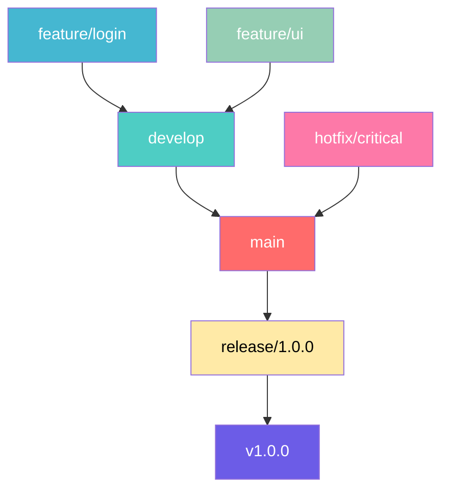

# Contributing Guidelines

> **안내**: 이 문서는 프로젝트 기여를 위한 권장 가이드라인입니다. 팀의 상황과 프로젝트 특성에 따라 유연하게 적용할 수 있습니다.


## **브랜치 전략**

### Git Flow 기반 브랜치 전략

#### 주요 브랜치
- **`main`** (또는 `master`): 프로덕션 준비 코드
- **`develop`**: 개발을 위한 통합 브랜치
- **`feature/*`**: 새로운 기능 개발
- **`hotfix/*`**: 긴급 버그 수정
- **`release/*`**: 릴리스 준비

#### 브랜치 네이밍 규칙

```
feature/이슈번호-간단한-설명
hotfix/이슈번호-간단한-설명
release/버전번호
```

**예시:**
```
feature/123-user-auth
hotfix/456-user-auth
release/1.2.0
```


#### 워크플로우

1. **기능 개발**
   ```bash
   # develop에서 feature 브랜치 생성
   git checkout develop
   git pull origin develop
   git checkout -b feature/123-user-auth
   
   # 개발 완료 후 해당 브랜치 push
   # push 이후 develop으로 PR 생성
   ```

2. **핫픽스**
   ```bash
   # main에서 hotfix 브랜치 생성
   git checkout main
   git pull origin main
   git checkout -b hotfix/456-user-auth

   # 개발 완료 후 해당 브랜치 push
   # push 이후 main과 develop 모두에 PR 생성
   ```

3. **릴리스**
   ```bash
   # develop에서 release 브랜치 생성
   git checkout develop
   git pull origin develop
   git checkout -b release/1.2.0

   # 개발 완료 후 해당 브랜치 push
   # push 이후 main으로 PR 생성
   ```



## 커밋 메시지 규칙

### 형식
```
타입(범위): 제목

본문

꼬리말
```

### 타입
- **feat**: 새로운 기능
- **fix**: 버그 수정
- **docs**: 문서만 변경
- **style**: 코드의 의미에 영향을 주지 않는 변경사항
- **refactor**: 버그를 수정하거나 기능을 추가하지 않는 코드 변경
- **perf**: 성능을 향상시키는 코드 변경
- **test**: 누락된 테스트 추가 또는 기존 테스트 수정
- **chore**: 빌드 프로세스 또는 보조 도구 변경


| 🏷️ Type    | 📝 활용상황                   | 💡 예제                                          |
| :--------- | :---------------------------- | :----------------------------------------------- |
| `feat`     | 새로운 기능 추가              | `feat: 사용자 로그인 기능 추가`                  |
| `fix`      | 버그 수정                     | `fix: 잘못된 계산 로직 수정`                     |
| `docs`     | 문서 수정                     | `docs: README 파일에 설치 방법 추가`             |
| `style`    | 코드 스타일 변경              | `style: 코드에서 불필요한 세미콜론 제거`         |
| `design`   | UI 디자인 변경                | `design: 메인 페이지 버튼 스타일 변경`           |
| `test`     | 테스트 코드 추가/수정         | `test: 로그인 기능에 대한 단위 테스트 추가`      |
| `refactor` | 리팩토링                      | `refactor: 중복된 코드 함수로 리팩토링`          |
| `build`    | 빌드 파일 수정                | `build: Webpack 설정 파일 수정`                  |
| `ci`       | CI 설정 파일 수정             | `ci: GitHub Actions 워크플로우 파일 수정`        |
| `perf`     | 성능 개선                     | `perf: API 응답 속도 향상을 위한 쿼리 최적화`    |
| `chore`    | 자잘한 수정이나 빌드 업데이트 | `chore: 패키지 버전 업데이트`                    |
| `rename`   | 파일/폴더명 수정              | `rename: login.js 파일명을 auth.js로 변경`       |
| `remove`   | 파일 삭제                     | `remove: 사용되지 않는 old_styles.css 파일 삭제` |

### 예시
```
feat(auth): OAuth2 통합 추가

Google과 GitHub OAuth2 프로바이더 지원 추가.
사용자가 기존 계정으로 로그인할 수 있습니다.

Closes #123
```
